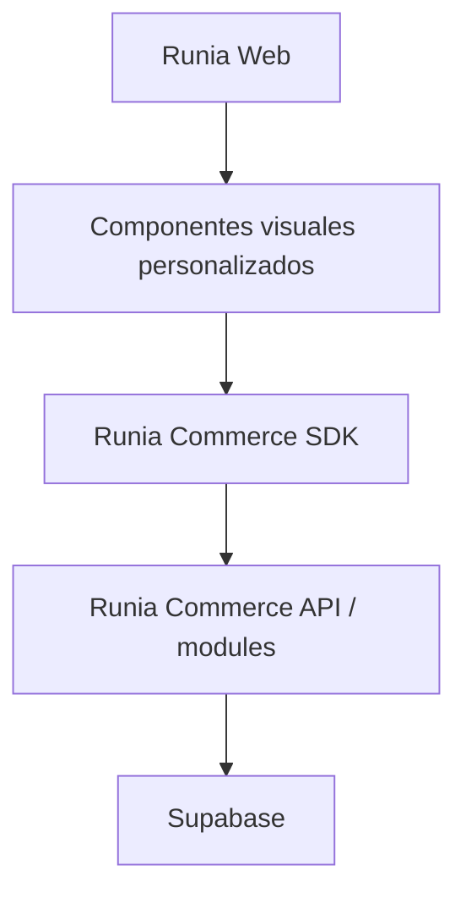

# Runia Commerce SDK - Especificacion Inicial

Estado: borrador estrategico y tecnico.

Runia Commerce es el motor comercial reutilizable de Runia. No genera sitios web ni define experiencias visuales. Expone capacidades comerciales para que cualquier sitio disenado por Runia pueda consumir productos, precios, cuentas, carritos y pedidos sin conocer Supabase ni la implementacion interna del motor.

Esta especificacion define la direccion del SDK. No representa una API publica estable ni autoriza todavia la creacion de un paquete externo.

## 1. Principios Del SDK

1. **Diseno desacoplado del motor.** La web controla presentacion y experiencia; Commerce controla reglas y datos comerciales.
2. **Supabase es una implementacion interna.** Ninguna web cliente puede consultar tablas, RPCs o Storage de Supabase directamente.
3. **Un unico punto de acceso.** Todo consumo comercial debe pasar por SDK, API controlada o hooks construidos sobre el SDK.
4. **Sin identidad visual obligatoria.** El SDK no define layout, colores, tipografias, cards, headers, footers ni animaciones.
5. **Multi-tenant desde el contrato.** Toda operacion se ejecuta dentro de un tenant resuelto y validado por el motor.
6. **Compatible con webs personalizadas.** Debe funcionar con Next.js, React y, mediante el Core SDK, con cualquier runtime JavaScript soportado.
7. **Precios autoritativos.** La web puede mostrar precios resueltos, pero no decide listas, descuentos ni reglas comerciales.
8. **Contratos estables, infraestructura reemplazable.** Los consumidores dependen de tipos y metodos del SDK, no del esquema de base de datos.
9. **Seguridad por defecto.** Credenciales privilegiadas, reglas de tenant y datos privados nunca se entregan al navegador.
10. **Capacidades progresivas.** Un tenant puede habilitar o deshabilitar catalogo, cuentas, pedidos, imagenes u otras funciones sin modificar la web.

### Responsabilidades

| Runia Web | Runia Commerce |
| --- | --- |
| Diseno e identidad | Productos y taxonomias |
| Layout y componentes | Resolucion de precios |
| UX y navegacion | Cuentas y sesiones comerciales |
| Copy y contenido editorial | Carritos y pedidos |
| Animaciones | Importaciones |
| SEO y metadata | Configuracion del tenant |
| Integracion visual de datos | Validacion, permisos y auditoria |

## 2. Arquitectura Conceptual



```text
Runia Web
  -> Componentes visuales personalizados
    -> Runia Commerce SDK
      -> Runia Commerce API / modules
        -> Supabase
```

### Capas Previstas

1. **Commerce Core:** tipos, contratos, errores, helpers y servicios agnosticos de React.
2. **Transport Adapter:** acceso interno directo a modules o acceso remoto a la API, con la misma interfaz publica.
3. **React Hooks:** estado, cache y sincronizacion para aplicaciones React.
4. **Commerce Blocks:** componentes opcionales construidos exclusivamente sobre SDK y hooks.

La web no debe cambiar su codigo de negocio al pasar del transporte interno a una API remota.

## 3. Forma Conceptual Del Cliente

El consumo deberia comenzar desde una instancia configurada, no desde funciones globales:

```ts
const commerce = createRuniaCommerceClient({
  tenant: "rb-distribuidora",
  transport,
});
```

La instancia expone dominios:

```ts
commerce.products
commerce.categories
commerce.brands
commerce.pricing
commerce.cart
commerce.orders
commerce.accounts
commerce.tenant
```

`tenant` identifica el contexto solicitado, pero el servidor debe validarlo. Un valor enviado por el navegador nunca prueba acceso a un tenant.

## 4. Dominios Iniciales

### Products

```ts
products.list(input?: CommerceProductListInput): Promise<CommercePage<CommerceProduct>>
products.getById(id: string): Promise<CommerceProduct | null>
products.getBySku(sku: string): Promise<CommerceProduct | null>
products.search(query: string, input?: CommerceProductSearchInput): Promise<CommercePage<CommerceProduct>>
products.featured(input?: CommerceFeaturedInput): Promise<CommerceProduct[]>
```

- `list()` admite categoria, marca, estado publico, orden y paginacion.
- `search()` busca por nombre, SKU, marca, linea y variante segun capacidades del tenant.
- `featured()` no implica un layout; devuelve productos marcados o una estrategia configurada.
- Los productos publicos nunca incluyen notas internas, costo ni campos de auditoria.

### Categories

```ts
categories.list(): Promise<CommerceCategory[]>
categories.tree(): Promise<CommerceCategoryNode[]>
```

`tree()` debe funcionar aunque la primera version utilice categorias planas.

### Brands

```ts
brands.list(): Promise<CommerceBrand[]>
```

### Pricing

```ts
pricing.resolve(input: CommercePriceResolveInput): Promise<CommercePrice | null>
pricing.listPriceLists(): Promise<CommercePriceList[]>
```

- `resolve()` usa tenant, sesion, account, lista, cantidad y reglas vigentes.
- El navegador no puede solicitar arbitrariamente una lista privada.
- El precio devuelto es el precio final utilizable por la web; costo y formula interna no se exponen.

### Cart

```ts
cart.get(): Promise<CommerceCart>
cart.add(input: CommerceCartAddInput): Promise<CommerceCart>
cart.updateQuantity(itemId: string, quantity: number): Promise<CommerceCart>
cart.remove(itemId: string): Promise<CommerceCart>
cart.clear(): Promise<CommerceCart>
```

- Toda mutacion devuelve el carrito canonico recalculado por el motor.
- La web no calcula el total autoritativo.
- La persistencia puede comenzar en sesion y evolucionar a carrito asociado a una Account.

### Orders

```ts
orders.create(input: CommerceOrderCreateInput): Promise<CommerceOrder>
orders.get(id: string): Promise<CommerceOrder | null>
orders.listByAccount(input?: CommerceOrderListInput): Promise<CommercePage<CommerceOrder>>
orders.duplicate(id: string): Promise<CommerceOrder>
```

- `create()` valida precios, cantidades y account antes de guardar snapshots.
- Las operaciones de escritura deben aceptar una clave de idempotencia.
- Los links o mensajes de WhatsApp pueden ser acciones derivadas del pedido, no logica visual obligatoria.

### Accounts

```ts
accounts.login(input: CommerceAccountLoginInput): Promise<CommerceSession>
accounts.logout(): Promise<void>
accounts.me(): Promise<CommerceAccount | null>
```

- La sesion es comercial y pertenece a un tenant.
- El SDK no expone tokens privilegiados ni detalles del proveedor de autenticacion.

### Tenant

```ts
tenant.getSettings(): Promise<CommerceTenant>
tenant.getBranding(): Promise<CommerceTenantBranding>
tenant.getPublicConfig(): Promise<CommercePublicConfig>
```

- `getPublicConfig()` entrega solamente flags y datos seguros para navegador.
- Configuracion privada, secretos e integraciones no forman parte de este contrato.

## 5. Hooks Futuros

Los hooks React son adaptadores sobre el Core SDK. No contienen reglas comerciales propias.

```ts
useProducts(input?: CommerceProductListInput)
useProduct(input: { id?: string; sku?: string })
useCategories()
useCart()
useAccount()
useTenant()
usePricing(input: CommercePriceResolveInput)
```

Cada hook deberia exponer como minimo:

```ts
type CommerceQueryState<T> = {
  data: T | null;
  error: CommerceError | null;
  isLoading: boolean;
  isRefreshing: boolean;
};
```

Las mutaciones de carrito y pedidos deben informar estados `isPending`, errores tipados y el recurso actualizado.

## 6. Componentes Opcionales Futuros

Commerce Blocks puede ofrecer componentes de referencia:

- `ProductGrid`
- `Price`
- `AddToCartButton`
- `CartDrawer`
- `ProductSearch`

Reglas:

- Son opcionales.
- Nunca son requisito para usar el SDK.
- No limitan la composicion de una web personalizada.
- Deben aceptar render props, slots o primitives reemplazables cuando corresponda.
- No deben introducir una identidad Runia Commerce dentro de la identidad del cliente.
- La fuente de verdad sigue siendo el Core SDK, no el estado interno del componente.

## 7. Contratos De Datos Preliminares

### Convenciones

- IDs: strings opacos. El consumidor no asume que son UUID.
- Fechas: ISO 8601 en UTC.
- Dinero: decimal serializado como string para evitar perdida de precision.
- Moneda: codigo ISO 4217 de tres letras.
- Campos ausentes: `null` cuando el campo existe en el contrato pero no tiene valor.
- Enumeraciones: unions TypeScript versionadas.
- Los contratos publicos no replican filas de Supabase.

```ts
export interface CommerceMoney {
  amount: string;
  currency: string;
}

export interface CommerceTenantBranding {
  logoUrl: string | null;
  primaryColor: string;
  secondaryColor: string;
}

export interface CommercePublicConfig {
  publicCatalog: boolean;
  orders: boolean;
  accountLogin: boolean;
  multiplePriceLists: boolean;
  images: boolean;
  currency: string;
  whatsapp: string | null;
}

export interface CommerceTenant {
  id: string;
  slug: string;
  commercialName: string;
  websiteUrl: string | null;
  branding: CommerceTenantBranding;
  publicConfig: CommercePublicConfig;
}

export interface CommerceCategory {
  id: string;
  name: string;
  slug: string;
  parentId: string | null;
  sortOrder: number;
}

export interface CommerceCategoryNode extends CommerceCategory {
  children: CommerceCategoryNode[];
}

export interface CommerceBrand {
  id: string;
  name: string;
  slug: string;
}

export interface CommercePrice {
  productId: string;
  priceListId: string;
  priceListCode: string;
  unitPrice: CommerceMoney;
  resolvedForAccountId: string | null;
  resolvedAt: string;
}

export interface CommerceProduct {
  id: string;
  sku: string;
  name: string;
  description: string | null;
  line: string | null;
  variant: string | null;
  category: CommerceCategory;
  brand: CommerceBrand;
  price: CommercePrice | null;
  featured: boolean;
}

export interface CommerceCartItem {
  id: string;
  productId: string;
  sku: string;
  productName: string;
  variant: string | null;
  quantity: number;
  unitPrice: CommerceMoney;
  subtotal: CommerceMoney;
}

export interface CommerceCart {
  id: string;
  tenantId: string;
  accountId: string | null;
  priceListId: string;
  items: CommerceCartItem[];
  itemCount: number;
  subtotal: CommerceMoney;
  discount: CommerceMoney;
  total: CommerceMoney;
  updatedAt: string;
}

export interface CommerceOrderItem {
  id: string;
  productId: string | null;
  skuSnapshot: string;
  productNameSnapshot: string;
  variantSnapshot: string | null;
  quantity: number;
  unitPriceSnapshot: CommerceMoney;
  subtotal: CommerceMoney;
}

export type CommerceOrderStatus =
  | "draft"
  | "pending"
  | "confirmed"
  | "preparing"
  | "delivered"
  | "closed"
  | "cancelled";

export interface CommerceOrder {
  id: string;
  tenantId: string;
  accountId: string;
  status: CommerceOrderStatus;
  priceListId: string;
  items: CommerceOrderItem[];
  subtotal: CommerceMoney;
  discount: CommerceMoney;
  total: CommerceMoney;
  notes: string | null;
  createdAt: string;
  updatedAt: string;
  actions: {
    whatsappUrl: string | null;
  };
}

export interface CommerceAccount {
  id: string;
  tenantId: string;
  name: string;
  legalName: string | null;
  taxId: string | null;
  email: string | null;
  whatsapp: string | null;
  priceListId: string | null;
  discountPercent: string;
  active: boolean;
}
```

### Contratos Auxiliares

```ts
export interface CommercePage<T> {
  items: T[];
  page: number;
  pageSize: number;
  total: number;
  totalPages: number;
}

export interface CommercePriceList {
  id: string;
  code: string;
  name: string;
  isDefault: boolean;
}

export interface CommerceProductListInput {
  search?: string;
  categoryId?: string;
  brandId?: string;
  sort?: "name" | "sku" | "price";
  direction?: "asc" | "desc";
  page?: number;
  pageSize?: number;
}

export interface CommerceProductSearchInput
  extends Omit<CommerceProductListInput, "search"> {}

export interface CommerceFeaturedInput {
  categoryId?: string;
  limit?: number;
}

export interface CommercePriceResolveInput {
  productId: string;
  quantity?: number;
  priceListId?: string;
}

export interface CommerceCartAddInput {
  productId: string;
  quantity: number;
}

export interface CommerceOrderCreateInput {
  cartId: string;
  notes?: string;
  channel?: "web" | "whatsapp" | "admin";
  idempotencyKey: string;
}

export interface CommerceOrderListInput {
  status?: CommerceOrderStatus;
  page?: number;
  pageSize?: number;
}

export interface CommerceAccountLoginInput {
  identifier: string;
  password: string;
}

export interface CommerceSession {
  account: CommerceAccount;
  expiresAt: string;
}
```

`CommerceOrderItem` contiene snapshots y no depende del producto vivo. La sesion puede mantenerse mediante cookie segura httpOnly; `CommerceSession` no obliga a exponer tokens al JavaScript del navegador.

## 8. Errores Y Resultados

El SDK debe ofrecer errores tipados y estables:

```ts
export type CommerceErrorCode =
  | "INVALID_INPUT"
  | "UNAUTHENTICATED"
  | "FORBIDDEN"
  | "TENANT_NOT_FOUND"
  | "FEATURE_DISABLED"
  | "RESOURCE_NOT_FOUND"
  | "PRICE_UNAVAILABLE"
  | "CONFLICT"
  | "RATE_LIMITED"
  | "INTERNAL_ERROR";

export interface CommerceError {
  code: CommerceErrorCode;
  message: string;
  fieldErrors?: Record<string, string>;
  requestId?: string;
}
```

Mensajes tecnicos de Supabase no deben atravesar el limite publico. El SDK puede conservar `cause` en servidor para observabilidad, pero la web recibe el contrato normalizado.

## 9. Ejemplos De Uso

### Ejemplo A: Landing Personalizada Con Destacados

```ts
const products = await commerce.products.featured({ limit: 6 });

return <HomeProductShowcase products={products} />;
```

`HomeProductShowcase` pertenece a Runia Web. El SDK no conoce su composicion, animaciones ni estilos.

### Ejemplo B: Catalogo Personalizado

```ts
const page = await commerce.products.list({
  categoryId: selectedCategory,
  brandId: selectedBrand,
  search: query,
  sort: "price",
  direction: "asc",
  page: 1,
  pageSize: 24,
});

return <ClientCatalogLayout products={page.items} />;
```

### Ejemplo C: Carrito Custom

```ts
async function addProduct(productId: string) {
  const cart = await commerce.cart.add({
    productId,
    quantity: 1,
  });

  setCustomCartState(cart);
}
```

El motor devuelve precio, subtotal y total recalculados. La UI decide como presentar el resultado.

### Ejemplo D: Pedido Por WhatsApp

```ts
const order = await commerce.orders.create({
  cartId: cart.id,
  notes: customerNotes,
  channel: "whatsapp",
  idempotencyKey: crypto.randomUUID(),
});

if (order.actions.whatsappUrl) {
  window.open(order.actions.whatsappUrl, "_blank", "noopener,noreferrer");
}
```

El pedido se crea antes de abrir WhatsApp. El motor conserva snapshots y entrega la accion disponible; la web controla el boton y la experiencia.

## 10. Reglas De Diseno

El SDK no debe imponer:

- Layout.
- Colores.
- Tipografias.
- Cards.
- Headers.
- Footers.
- Breakpoints.
- Animaciones.
- Copy comercial.
- Estructura SEO.

El SDK puede proveer:

- Datos normalizados.
- Estados y errores.
- Helpers de moneda y cantidades.
- Resolucion de precios.
- Helpers de mensajes o URLs comerciales.
- Metadata factual de productos cuando exista.
- Primitives sin estilo y Commerce Blocks opcionales en fases posteriores.

Los colores y branding de `CommerceTenant` son datos para que la web decida si los utiliza. No obligan a generar un tema automatico.

## 11. Seguridad Y Multi-Tenant

- El Core SDK usado en navegador nunca recibe `service_role` ni credenciales de Supabase.
- La API resuelve tenant por dominio, slug firmado o credencial publica controlada.
- Toda query y command valida `tenant_id` en servidor.
- Sesiones de Accounts no autorizan acceso a otros tenants.
- Listas privadas y precios mayoristas requieren contexto autorizado.
- Las mutaciones usan proteccion CSRF cuando aplique, rate limiting e idempotencia.
- CORS debe permitir solamente origenes registrados por tenant.
- Logs y errores no exponen secretos, SQL ni estructura interna.
- El SDK debe separar claramente metodos publicos, autenticados y administrativos.

## 12. Versionado Y Compatibilidad

- El contrato debe usar version semantica cuando exista un paquete.
- La API remota debe versionarse, inicialmente bajo `/api/commerce/v1`.
- Agregar campos opcionales es compatible; eliminar o cambiar semantica requiere version mayor.
- Los consumidores no deben depender de campos no documentados.
- Core, hooks y blocks pueden versionarse por separado si sus ciclos divergen.

## 13. Roadmap Tecnico

### Fase 1: SDK Interno En El Mismo Repo

- Crear contratos publicos independientes de filas Supabase.
- Crear una fachada interna sobre modules existentes.
- Implementar primero Tenant, Products, Categories, Brands y Pricing de lectura.
- Mantener transporte server-only para evitar una API prematura.
- Agregar pruebas de contratos y aislamiento de tenant.

### Fase 2: API Routes Publicas Controladas

- Publicar endpoints versionados para lecturas publicas.
- Incorporar CORS por origen, rate limiting, cache y request IDs.
- Mantener escrituras y datos privados cerrados hasta definir autenticacion.

### Fase 3: Hooks React

- Implementar hooks sobre el cliente estable.
- Definir estrategia de cache, invalidacion y SSR/hidratacion.
- No duplicar reglas en hooks.

### Fase 4: Paquete Reutilizable Interno

- Extraer Core y transport HTTP a un paquete interno, candidato: `@runia/commerce`.
- Definir builds server/browser y politica de compatibilidad.
- Publicar solamente en el registry privado de Runia al inicio.

### Fase 5: Commerce Blocks Opcionales

- Construir primitives accesibles y sin identidad visual rigida.
- Mantener ejemplos y bloques separados del Core SDK.
- Validar que cualquier web pueda reemplazarlos completamente.

## 14. Primer MVP Tecnico Recomendado

El primer MVP no debe intentar resolver carrito, login y pedidos remotos simultaneamente. Debe validar el limite arquitectonico con lectura publica.

### Alcance

1. `createCommerceContext({ tenantSlug, actor })` server-only.
2. `tenant.getPublicConfig()`.
3. `products.list()`, `products.getById()`, `products.getBySku()` y `products.search()`.
4. `categories.list()` y `brands.list()`.
5. `pricing.resolve()` para lista publica/default.
6. Adaptador interno que usa los modules actuales sin exponer Supabase.
7. Errores normalizados y pruebas de contrato.
8. Migrar `/catalogo` para consumir esa fachada como primer consumidor real.

### Fuera Del Primer MVP

- API publica.
- Hooks React.
- Accounts y autenticacion.
- Carrito persistente.
- Creacion de pedidos desde webs externas.
- Paquete npm.
- Commerce Blocks.

### Criterios De Exito

- `/catalogo` no importa modules de persistencia ni Supabase.
- Dos tenants pueden ejecutar la misma operacion sin mezclar resultados.
- La lista publica se resuelve en servidor y no desde parametros confiados al cliente.
- Los contratos no contienen nombres de columnas de Supabase.
- Los errores son estables y no filtran mensajes internos.
- Existe una prueba de contrato por metodo publico del MVP.
- Cambiar el adaptador interno por uno HTTP no obliga a cambiar la interfaz consumida por Runia Web.

## 15. Decisiones Pendientes Antes De Una API Publica

- Resolucion de tenant por dominio custom, subdominio o token publico.
- Proveedor y modelo de autenticacion para Accounts.
- Estrategia de carrito anonimo y recuperacion de sesion.
- Cache publica e invalidacion despues de importaciones o cambios de precio.
- Limites de rate y cuotas por tenant.
- Convencion definitiva de dinero y redondeo entre API y SDK.
- Politica de compatibilidad de precios cuando una lista no tiene cobertura completa.
- Observabilidad, request IDs y trazabilidad distribuida.

## 16. Renombrado Futuro

El repositorio actual `runia-catalog-system` deberia evaluarse para renombrarse a `runia-commerce` o `runia-commerce-engine` porque su alcance ya excede un catalogo: incluye pricing, accounts, sales, importaciones, configuracion multi-tenant y una futura capa SDK.

No se debe renombrar todavia. La decision debe tomarse cuando:

- La fachada interna del SDK tenga contratos estables.
- El impacto en imports, deploys, variables y documentacion este relevado.
- Se defina si el repo representa el producto completo (`runia-commerce`) o solamente el motor (`runia-commerce-engine`).

## 17. Regla De Gobierno

Toda nueva capacidad comercial debe responder tres preguntas antes de incorporarse:

1. Es una regla o dato comercial que pertenece a Commerce?
2. Puede consumirse sin imponer una experiencia visual?
3. Mantiene aislamiento de tenant y un contrato independiente de Supabase?

Si la respuesta a alguna es no, la capacidad probablemente pertenece a Runia Web, a un adaptador especifico o necesita redisenarse antes de entrar al SDK.
