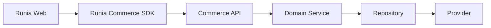

# Runia Commerce - Domain Architecture

Estado: arquitectura oficial.

Este documento define la direccion obligatoria para el desarrollo futuro de Runia Commerce. La estructura `core/` creada en esta etapa contiene solamente contratos TypeScript. No implementa casos de uso, no reemplaza los modulos actuales y no modifica la persistencia.

> **Regla rectora:** El conocimiento del negocio vive en Domain. Todo lo demas es reemplazable.

## 1. Que Es El Domain Layer

El Domain Layer es el nucleo estable de Runia Commerce. Expresa conceptos comerciales, entradas, salidas, errores y capacidades sin depender de la forma en que llegan las solicitudes ni de la tecnologia usada para guardar datos.

En este proyecto, el Domain Layer se representa inicialmente mediante:

```text
core/
  products/
  pricing/
  orders/
  accounts/
  tenant/
  imports/
```

Cada dominio contiene:

- `interfaces.ts`: entidades, value objects, comandos y queries del dominio.
- `errors.ts`: codigos de error y resultados tipados.
- `service.ts`: port que debera implementar el servicio de dominio futuro.

Los archivos actuales son declaraciones. No contienen clases concretas, acceso a datos ni logica funcional.

## 2. Responsabilidades Del Domain Layer

El Domain Layer debe:

1. Definir el lenguaje comun del negocio.
2. Modelar productos, precios, cuentas, pedidos, tenants e importaciones.
3. Definir invariantes y reglas comerciales cuando se implementen los servicios.
4. Exponer casos de uso mediante interfaces de servicio.
5. Requerir un contexto de tenant explicito para cada operacion comercial.
6. Producir resultados y errores estables, independientes del provider.
7. Coordinar repositories mediante interfaces, nunca mediante clientes concretos.
8. Mantener snapshots y estados comerciales cuando el dominio lo requiera.
9. Ser ejecutable y testeable sin React, Next.js, HTTP o Supabase.

Ejemplos de reglas que pertenecen al Domain Layer futuro:

- Un SKU debe ser unico dentro de un tenant.
- Un precio debe resolverse para una lista autorizada.
- Un pedido no puede crearse sin Account o items validos.
- Los items de pedido conservan snapshots.
- Una importacion con errores criticos queda bloqueada.
- Un cambio de estado debe respetar transiciones permitidas.

## 3. Responsabilidades Que No Tiene

El Domain Layer no debe:

- Renderizar componentes o HTML.
- Administrar estado de React.
- Leer cookies, headers, rutas o `FormData` de Next.js.
- Crear responses HTTP.
- Ejecutar queries de Supabase.
- Conocer tablas, columnas, RLS, RPCs o buckets.
- Leer variables de entorno.
- Aplicar estilos, branding visual o layout.
- Decidir cache HTTP, revalidacion de rutas o CORS.
- Generar DTOs especificos de una pantalla.
- Importar archivos desde `app/`, `components/`, `lib/` o `modules/`.

Una regla practica: si una unidad necesita `react`, `next/*` o `@supabase/supabase-js`, no pertenece a `core/`.

## 4. Relacion Con Las Otras Capas

### Repository Layer

El Repository Layer adapta persistencia y providers a contratos que el Domain pueda consumir.

Responsabilidades:

- Leer y escribir entidades.
- Traducir filas del provider a objetos del dominio.
- Aplicar siempre el filtro de tenant recibido.
- Manejar detalles de transacciones, SQL, Supabase y Storage.
- Convertir errores del provider a fallos internos controlados.

El Repository no decide reglas comerciales. No debe resolver por su cuenta si una lista esta autorizada, si un pedido puede cambiar de estado o si una importacion debe continuar.

Los ports de repository se definiran cuando comience la implementacion de cada servicio. No se crearon en esta etapa para evitar fijar contratos de persistencia antes de implementar los primeros casos de uso.

### Commerce API

La Commerce API es un adapter de entrada.

Responsabilidades:

- Resolver tenant, sesion y actor.
- Validar estructura basica del transporte.
- Crear `TenantExecutionContext`.
- Invocar un service del Domain.
- Traducir `DomainError` a status y error publico.
- Aplicar CORS, rate limiting e idempotencia de transporte.

La API no replica reglas del Domain y no consulta Supabase directamente para completar un caso de uso comercial.

### Runia Commerce SDK

El SDK es la interfaz de consumo para Runia Web u otros clientes autorizados.

Responsabilidades:

- Ofrecer una API ergonomica y versionada.
- Invocar Commerce API o un adapter interno equivalente.
- Transformar DTOs publicos cuando sea necesario.
- Proveer helpers y hooks en fases posteriores.

El SDK no importa repositories ni conoce el provider. Sus contratos publicos pueden ser mas pequenos que las entidades internas del Domain.

### Runia Web

Runia Web es responsable de:

- Diseno.
- Identidad visual.
- UX y navegacion.
- Copy.
- Animaciones.
- SEO.
- Composicion de componentes.

Runia Web consume el SDK. No consume Domain, Repository ni Supabase de forma directa.

## 5. Flujo Completo



```text
Runia Web -> SDK -> API -> Domain -> Repository -> Provider
```

Ejemplo conceptual para consultar un producto:

1. Runia Web llama `sdk.products.getBySku(sku)`.
2. El SDK envia la solicitud a Commerce API.
3. La API resuelve tenant y actor.
4. La API crea `TenantExecutionContext`.
5. La API invoca `ProductsService.getBySku(context, sku)`.
6. El servicio aplica reglas y solicita datos al repository.
7. El repository consulta el provider configurado.
8. El resultado vuelve por las capas en sentido inverso.
9. La web decide como mostrarlo.

Supabase es el provider inicial. La arquitectura permite reemplazarlo o combinarlo con otros providers sin cambiar Runia Web ni el SDK.

## 6. Principios Arquitectonicos

### El Domain No Conoce React

- No usa hooks.
- No importa componentes.
- No produce JSX.
- No administra loading, modales o toasts.

### El Domain No Conoce Next.js

- No usa server actions.
- No llama `revalidatePath`.
- No lee `cookies()` ni `headers()`.
- No recibe `Request`, `Response` o `FormData`.

### El Domain No Conoce Supabase

- No importa clientes Supabase.
- No conoce nombres de tablas o columnas.
- No procesa errores PostgREST.
- No contiene claves ni politicas RLS.

### El Domain Solo Conoce Interfaces

- Los services dependen de interfaces del propio `core/`.
- Los futuros services concretos recibiran repository ports por inyeccion.
- Toda dependencia apunta hacia el Domain; el Domain no apunta a infraestructura.

### Multi-Tenant Explicito

- Toda operacion, salvo resolucion inicial del tenant, recibe `TenantExecutionContext`.
- `tenantId` no se obtiene desde una variable global dentro del Domain.
- El actor forma parte del contexto para permisos y auditoria futura.
- El Repository debe volver a aplicar el scope del tenant; no confia solamente en capas superiores.

### Resultados Tipados

Los ports no exponen errores de infraestructura. Cada dominio utiliza una union:

```ts
type DomainResult<T> =
  | { ok: true; value: T }
  | { ok: false; error: DomainError };
```

Cada `errors.ts` especializa codigos y `domain`. Esto permite que API y SDK traduzcan errores sin inspeccionar mensajes de Supabase.

## 7. Interfaces Principales

### Tenant

Archivo: `core/tenant/service.ts`

```ts
interface TenantService {
  resolve(input): Promise<TenantResult<TenantSettings>>;
  getSettings(context): Promise<TenantResult<TenantSettings>>;
  getBranding(context): Promise<TenantResult<TenantBranding>>;
  getPublicConfig(context): Promise<TenantResult<TenantPublicConfig>>;
  updateSettings(context, input): Promise<TenantResult<TenantSettings>>;
}
```

`resolve()` es la unica operacion que puede ejecutarse antes de contar con `TenantExecutionContext`.

### Products

Archivo: `core/products/service.ts`

Capacidades definidas:

- Listar, buscar y obtener por ID o SKU.
- Obtener destacados.
- Crear y actualizar.
- Activar o desactivar.

Products no incluye precios. La composicion producto + precio corresponde al caso de uso o DTO publico que coordina Products y Pricing.

### Pricing

Archivo: `core/pricing/service.ts`

Capacidades definidas:

- Resolver precio final.
- Listar listas disponibles para el contexto.
- Guardar precio manual.
- Recalcular precios segun alcance.

`Money.amount` es string decimal para evitar perdida de precision. El Domain definira redondeo y moneda antes de implementar el servicio.

### Orders

Archivo: `core/orders/service.ts`

Capacidades definidas:

- Crear, obtener y listar.
- Listar por Account.
- Actualizar items y notas.
- Cambiar estado.
- Duplicar.

`OrderItem` utiliza snapshots de SKU, nombre, variante y precio. El pedido no depende del producto vivo para preservar su historia.

### Accounts

Archivo: `core/accounts/service.ts`

Capacidades definidas:

- Autenticar credenciales comerciales.
- Obtener, listar, crear y actualizar Accounts.
- Cambiar estado.

La creacion y destruccion de cookies pertenece a API. El Domain autentica y devuelve `AccountPrincipal`; no implementa sesiones HTTP.

### Imports

Archivo: `core/imports/service.ts`

Capacidades definidas:

- Generar preview.
- Ejecutar una fuente validada.
- Obtener batch.
- Listar batches.

El adapter de entrada convierte upload, request o archivo local en `ImportSource`. El Domain no conoce `File`, rutas de Windows ni APIs de navegador.

## 8. Matriz De Dependencias

| Capa | Puede depender de | No puede depender de |
| --- | --- | --- |
| Runia Web | SDK | API interna, Domain, Repository, Supabase |
| SDK | Commerce API / transport | Repository, provider |
| Commerce API | Domain, auth y transport | Supabase para reglas comerciales |
| Domain | Interfaces de `core/` | React, Next.js, Supabase, UI |
| Repository | Domain ports, provider | UI, SDK |
| Provider | SDK del proveedor | Domain rules, UI |

Direccion de dependencias:

```text
Web -> SDK -> API -> Domain <- Repository <- Provider adapter
```

El Domain ocupa el centro. Repository implementa dependencias requeridas por el Domain; no invierte esta direccion importando services concretos desde infraestructura.

## 9. Estructura Creada

```text
core/
  products/
    service.ts
    interfaces.ts
    errors.ts
  pricing/
    service.ts
    interfaces.ts
    errors.ts
  orders/
    service.ts
    interfaces.ts
    errors.ts
  accounts/
    service.ts
    interfaces.ts
    errors.ts
  tenant/
    service.ts
    interfaces.ts
    errors.ts
  imports/
    service.ts
    interfaces.ts
    errors.ts
```

No se agregaron implementaciones, factories, containers, repositories ni adapters.

## 10. Adopcion Incremental

Los modulos existentes siguen siendo la implementacion funcional actual. No deben moverse de forma masiva.

La adopcion futura debe hacerse caso por caso:

1. Seleccionar un caso de uso pequeno y estable.
2. Confirmar o ajustar el port de `core/` antes de implementar.
3. Crear repository ports requeridos por ese caso.
4. Implementar el service con dependencias inyectadas.
5. Crear un adapter sobre la persistencia actual.
6. Agregar pruebas unitarias del Domain y contract tests del repository.
7. Cambiar el consumidor para usar el nuevo service.
8. Retirar la ruta anterior solamente cuando exista paridad comprobada.

Primer candidato recomendado: lectura publica de Product + Pricing para `/catalogo`. Tiene bajo riesgo de escritura y permite validar tenant scope, mapping y composicion entre dominios.

## 11. Reglas Para Desarrollo Futuro

- Ninguna implementacion concreta debe agregarse dentro de `interfaces.ts` o `errors.ts`.
- `service.ts` mantendra el port; la implementacion vivira en un archivo o paquete separado.
- No agregar campos a una entidad porque una pantalla puntual los necesita. Primero decidir si pertenecen al dominio o a un DTO de API.
- No reutilizar filas de Supabase como entidades del Domain.
- No retornar `any` ni errores sin codigo.
- No asumir tenant desde variables globales.
- No ejecutar efectos fuera de repositories o adapters dedicados.
- No importar `modules/*` desde `core/*`.
- No romper los modulos actuales hasta completar una migracion vertical con pruebas.

## 12. Criterios De Validacion Arquitectonica

Antes de considerar implementado un service futuro, debe verificarse:

1. Puede probarse con repositories en memoria.
2. No importa React, Next.js o Supabase.
3. Todos los metodos reciben scope de tenant cuando corresponde.
4. Sus errores pertenecen al catalogo tipado del dominio.
5. No expone columnas o errores del provider.
6. La API puede mapear sus resultados sin reinterpretar reglas.
7. El SDK puede consumir el DTO resultante sin conocer persistencia.
8. Existe contract test para cada repository adapter.

## 13. Estado Actual

Esta etapa deja definido el sentido de la arquitectura, no una segunda implementacion del producto.

- `core/*`: contratos oficiales nuevos.
- `modules/*`: implementacion funcional existente, sin cambios.
- `app/*`: pantallas existentes, sin cambios.
- Supabase: sin cambios.

La siguiente etapa tecnica debera elegir un unico corte vertical y demostrar el flujo Domain -> Repository -> Provider antes de extender la arquitectura a todos los modulos.
