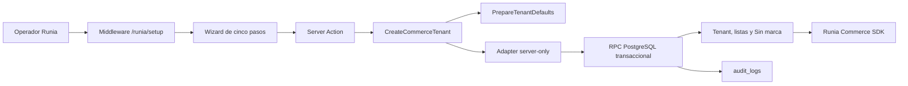

# Runia Setup Engine v0

Estado: implementado en el repositorio; migración pendiente de aplicar en el entorno Supabase  
Ruta interna: `/runia/setup`  
Fecha de validación: 2026-07-14

## 1. Propósito

Runia Setup Engine configura el motor comercial de una empresa nueva desde una herramienta exclusivamente interna. Reemplaza el alta manual y no es onboarding de autoservicio.

Configura:

- identidad, slug, contacto, moneda, locale y estado inicial;
- mínimos comerciales y feature flags;
- listas de precios iniciales y lista pública predeterminada;
- logo URL y dos colores públicos opcionales;
- marca controlada `Sin marca`;
- eventos de auditoría;
- resumen técnico y snippet para `createCommerceClient()`.

No configura:

- diseño, theme, layout, header, cards o plantilla;
- dominio, Vercel o una web nueva;
- catálogo dentro del asistente;
- usuarios, roles, planes, facturación o Supabase por cliente;
- checkout, Client SDK o paquete npm.

La web continúa siendo un desarrollo personalizado de Runia Web.

## 2. Flujo interno

1. **Identidad:** nombre, slug normalizado, razón social, email, WhatsApp, moneda, locale y estado `active` o `setup`.
2. **Comercio:** pedido mínimo, compra mínima y funcionalidades existentes.
3. **Listas:** Minorista y Mayorista como defaults editables; permite agregar hasta 10 listas y exige una única default activa.
4. **Datos públicos:** logo URL y colores. La interfaz aclara que estos valores no diseñan la web.
5. **Confirmación:** muestra tenant, contacto, moneda, listas, flags y configuración pública antes de habilitar `Crear comercio`.

El resultado muestra tenant ID interno, slug, estado, listas creadas, funcionalidades, snippet SDK y seis próximos pasos operativos.

Un tenant `active` puede resolverse inmediatamente mediante el SDK. Un tenant `setup` queda disponible para el workspace e importador internos, pero el SDK público lo considera inactivo hasta que Runia complete y active su configuración.

## 3. Arquitectura



### Domain

- `core/tenant/use-cases/PrepareTenantDefaults.ts`: normalización y reglas puras.
- `core/tenant/use-cases/CreateCommerceTenant.ts`: orquestación, idempotencia pública y errores controlados.
- `core/tenant/setup.ts`: contratos, port de persistencia y defaults del Domain.

No importan React, Next.js ni Supabase.

### Módulo Setup

`modules/setup/` contiene:

- `types.ts`: tipos de formulario, comando y respuesta RPC;
- `defaults.ts`: defaults de UI para listas y funcionalidades;
- `validators.ts`: frontera de transporte no confiable;
- `mapper.ts`: payload y resultado de la RPC;
- `queries.ts`: adapter Supabase server-only;
- `commands.ts`: Server Action con revalidación de sesión;
- `contract.test.ts`: contratos de Setup.

### UI

La UI vive en `app/runia/setup/`. No se agregaron librerías visuales ni componentes al SDK. `/runia/tenants/new` redirige al Setup Engine para evitar mantener un segundo alta no transaccional.

## 4. Persistencia transaccional

La migración `db/migrations/009_runia_setup_engine_v0.sql` agrega la RPC `setup_create_commerce_tenant(jsonb)`.

Cada llamada de PostgreSQL es una transacción única. Crea:

- tenant y configuración inicial;
- listas de precios;
- vínculo `default_price_list_id`;
- marca controlada `Sin marca` con ID externo `RUNIA-SIN-MARCA`;
- cuatro eventos de auditoría.

Si cualquier escritura falla, PostgreSQL revierte la llamada completa.

### Idempotencia

- `tenants.slug` sigue siendo unique y funciona como idempotency key pública de v0.
- La RPC toma un advisory transaction lock derivado del slug antes de leer o crear.
- Si el slug existe, devuelve `state: exists` sin escribir datos.
- El Domain lo transforma en `TENANT_ALREADY_EXISTS`, con error de campo estable.

### Default único

La migración crea el índice parcial único:

```sql
create unique index price_lists_one_default_per_tenant_idx
  on public.price_lists(tenant_id)
  where is_default = true;
```

Antes de crear el índice se comprueba que ningún tenant existente tenga dos defaults. Si hay datos inválidos, la migración falla de forma explícita en vez de modificarlos silenciosamente.

## 5. Cambios de esquema demostrados

La migración agrega solamente:

- `tenants.locale`, porque el formulario debe configurarlo y el SDK ya expone locale;
- `tenants.feature_show_prices`, porque “mostrar precios” está en el alcance y no existía un flag equivalente;
- estado `setup` dentro del check existente;
- restricción de una sola lista default;
- RPC transaccional.

`showPrices` se expone como `tenant.features.showPrices`. El SDK continúa devolviendo precios autoritativos; la web decide presentarlos según esa preferencia.

Las lecturas públicas y `/admin/configuracion` tienen fallback al esquema anterior para permitir un despliegue ordenado de código y migración sin interrumpir RB.

## 6. Seguridad

Variable server-only obligatoria:

```text
RUNIA_INTERNAL_PASSWORD=una-clave-interna-fuerte
```

Debe estar configurada antes del build/deploy. Nunca debe usar prefijo `NEXT_PUBLIC`.

Controles implementados:

- cookie propia `runia_internal_setup_session`, separada de `runia_admin_session`;
- firma HMAC con payload exclusivo de Setup;
- vida de sesión de 4 horas;
- cookie `httpOnly`, `sameSite=strict`, `secure` en producción y limitada a `/runia/setup`;
- middleware independiente: una sesión Admin no concede acceso a Setup;
- Server Action vuelve a validar la cookie antes de escribir;
- Supabase sólo se importa desde el adapter server-only;
- la RPC revoca ejecución a `public`, `anon` y `authenticated`, y la concede sólo a `service_role`;
- contraseñas, cookies y secrets no se escriben en `audit_logs`.

El bundle de `/runia/setup` no contiene Supabase, la RPC, el adapter, nombres de variables secretas ni valores de secrets.

## 7. Auditoría

La misma transacción registra:

- `tenant.created`;
- `tenant.defaults_created`;
- `price_lists.created`;
- `setup.completed`.

Los payloads contienen IDs, slug, estado, flags y resumen de listas. No contienen contraseña interna, service role ni cookie.

## 8. Compatibilidad con el importador

El importador ahora detecta la marca controlada por `is_controlled_placeholder`. Si el XLSX trae `Sin marca` con otro ID externo, actualiza y reutiliza el placeholder en lugar de intentar crear otro registro con slug `sin-marca`.

El asistente no importa datos automáticamente. Sólo deja listas, placeholder y flags listos para el flujo existente de `/admin/importador`.

## 9. Despliegue

1. Configurar `RUNIA_INTERNAL_PASSWORD` en el entorno de servidor antes del build.
2. Aplicar migraciones en orden, incluyendo `009_runia_setup_engine_v0.sql`, mediante el pipeline normal de base de datos.
3. Ejecutar `npm run test:contracts`.
4. Ejecutar `npm run build`.
5. Abrir `/runia/setup`, autenticar y crear un tenant `active` de QA.
6. Resolverlo con `createCommerceClient({ tenantSlug })` y eliminarlo sólo mediante un procedimiento operativo autorizado si era descartable.

La migración se aplica una vez por entorno. Crear cada comercio después de eso no requiere SQL ni edición manual de Supabase.

## 10. QA ejecutado

| Validación | Resultado |
| --- | --- |
| Preparación de tenant nuevo | contrato correcto |
| Slug duplicado no duplica | contrato correcto; una sola creación en repository de prueba |
| Retry controlado | `TENANT_ALREADY_EXISTS` |
| Listas y pricing mode | contrato correcto |
| Una sola lista default | Domain + índice SQL |
| Feature flags exactos | contrato correcto |
| SDK resuelve tenant `active` | contrato con cliente SDK correcto |
| Otro slug no accede | `TENANT_NOT_FOUND` |
| Sesión Setup separada de Admin | contrato HMAC/cookie correcto |
| Secrets en bundle | cero coincidencias |
| TypeScript | correcto |
| SDK anterior | 22/22 contratos correctos |
| Setup | 9/9 contratos correctos |
| Build final | correcto; 52,2 s total, 9,8 s de compilación |
| `/runia/setup` sin sesión | HTTP 307 a login propio |
| `/runia/setup/login` | HTTP 200 |
| `/catalogo` | HTTP 200, 79.096 B |
| `/demo-commerce` | HTTP 200, 32.739 B |

Bundle de producción:

- `/runia/setup`: 5,62 kB de código de ruta; 111 kB First Load JS;
- `/catalogo`: 118 kB;
- `/catalogo/[sku]`: 116 kB;
- `/demo-commerce`: 106 kB.

La prueba real de escritura contra Supabase no se ejecutó: este entorno posee service role para la aplicación, pero no Supabase CLI, `psql` ni contraseña de base para aplicar la migración. No se simuló una aprobación. Debe completarse después de desplegar `009`.

## 11. Tiempo de implementación medido

El tramo instrumentable desde la creación del primer archivo de Setup hasta el build final, incluyendo el ajuste del importador, contratos y documentación, fue de **25,4 minutos**. La auditoría inicial de esquema ocurrió antes de ese timestamp y no se incluye para evitar presentar como exacta una duración no instrumentada.

## 12. Problemas detectados

1. El alta anterior hacía rollback compensatorio desde JavaScript y podía dejar datos parciales. Se sustituyó para Setup por una RPC transaccional.
2. `locale`, `showPrices` y estado `setup` no existían en el esquema. Se incorporaron únicamente porque el alcance los requiere.
3. No existía una restricción física para una única lista default. Se agregó un índice parcial.
4. El placeholder `Sin marca` podía colisionar con el importador. Ahora el importador reutiliza el registro controlado.
5. El entorno local no permite aplicar la migración ni completar el E2E real. Este punto permanece como QA de despliegue obligatorio.
